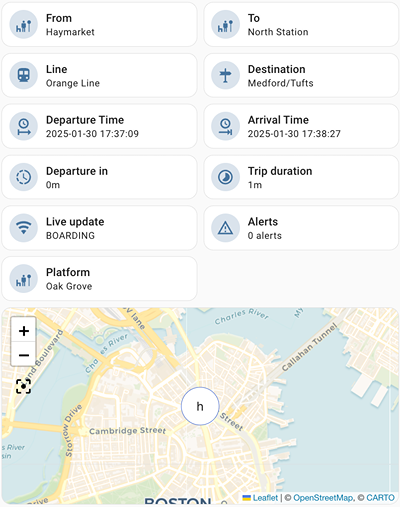
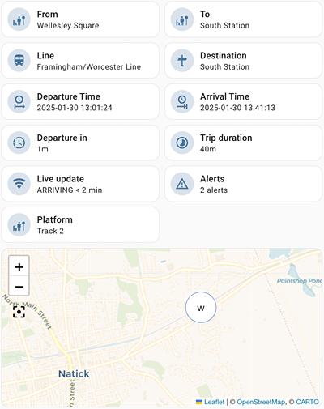
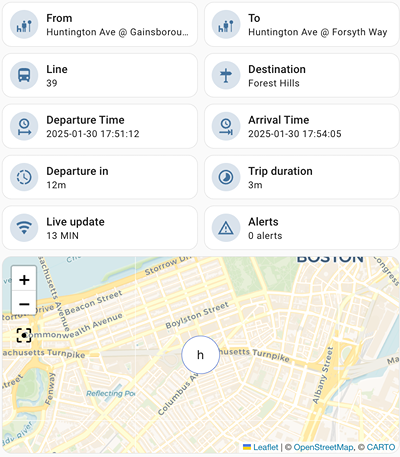
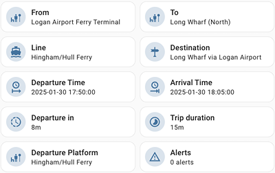

# MBTALive Sensor for Home Assistant  

MBTALive is an independent project and is not affiliated with or endorsed by the Massachusetts Bay Transportation Authority (MBTA). Transit data is provided by the MBTA.  

## Overview  

MBTALive is a Home Assistant integration that provides real-time MBTA transit data, including:  
- **Trains, subways, buses, and ferries**  
- **Live arrival times, geolocation, platform informations and alerts**  
- **Customizable tracking for specific trips (departure → arrival stops)**  
- **Support for multiple routes and lines to find the fastest option**  

Easily monitor your commute and get up-to-date transit information directly in Home Assistant.  

Subways  
  
Trains  
  
Buses (No platform)  
  
Ferries (No live update)  

## Features

- Real-time MBTA transit information for trains, subways, buses, and ferries.  
- Geolocation for trains, subways, and buses.  
- Information is provided on a **trip basis** (direct connection from departure stop to arrival stop).  
- Details for two trips:  
  - **Current trip:** The next trip arriving at the departure stop.  
  - **Next trip:** The following trip, available in the `next` attribute of each sensor.  
- Trips support multiple routes (trains, subways, etc.) and multiple lines (e.g., Green Line A, Orange Line), ensuring the best solution at any given moment.  
- Trips are sorted by **arrival time at the arrival stop** (fastest way to get there).  
- Frequent updates for accurate trip tracking.  

## Installation

### **1. Install HACS (if not already installed)**
Follow the [HACS installation guide](https://hacs.xyz/).

### **2. Add MBTAlive to HACS**
1. Open Home Assistant → HACS.  
2. Click the three dots (top-right) → "Custom repositories".  
3. Add `https://github.com/chiabre/MBTAlive` as a **repository** under "Integration".  
4. Click "Add".  

### **3. Install MBTAlive**
1. Find **MBTAlive** in HACS.  
2. Click "Install" and choose a version (**2.0+ required for HACS**).  

### **4. Configure the Integration**
1. Restart Home Assistant.  
2. Go to **Settings → Devices & Services → + Add Integration**.  
3. Search for **MBTAlive** and follow the setup steps:  
   - **Station names**: Use valid names (e.g., "South Station", "Park Street"). See [MBTA Stops](https://www.mbta.com/stops/subway).  
   - **MBTA API Key**:  
     1. Visit the [MBTA API Page](https://api-v3.mbta.com/).  
     2. Sign up and generate a free API key.  

## Updating
HACS will notify you of updates. To update:  
1. Go to **HACS → MBTAlive**.  
2. Click **Update**.  
3. Restart Home Assistant.  

## Contributing  
Contributions are welcome! Open an issue or submit a pull request.  

## Support  
For help, open an issue on this GitHub repository.  

